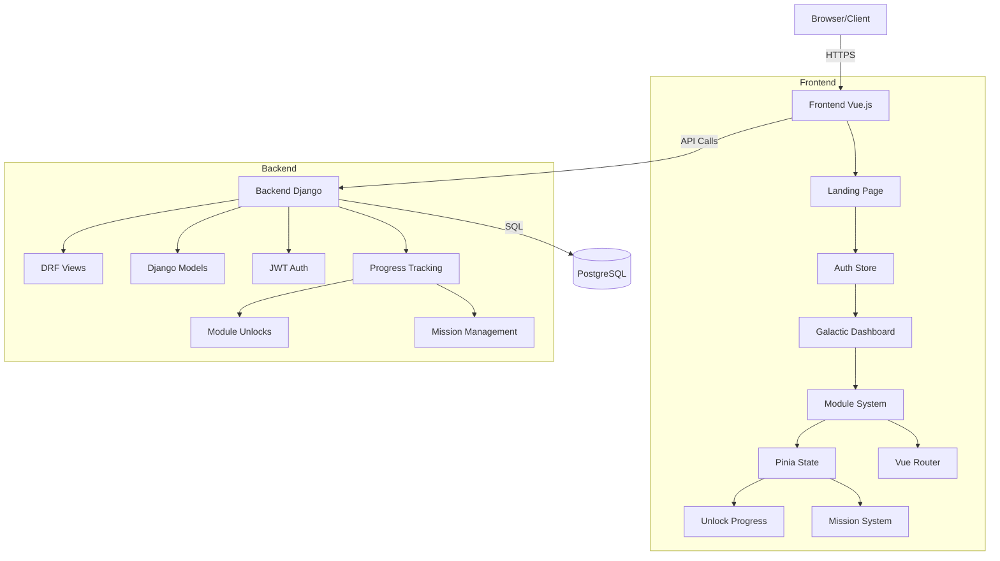
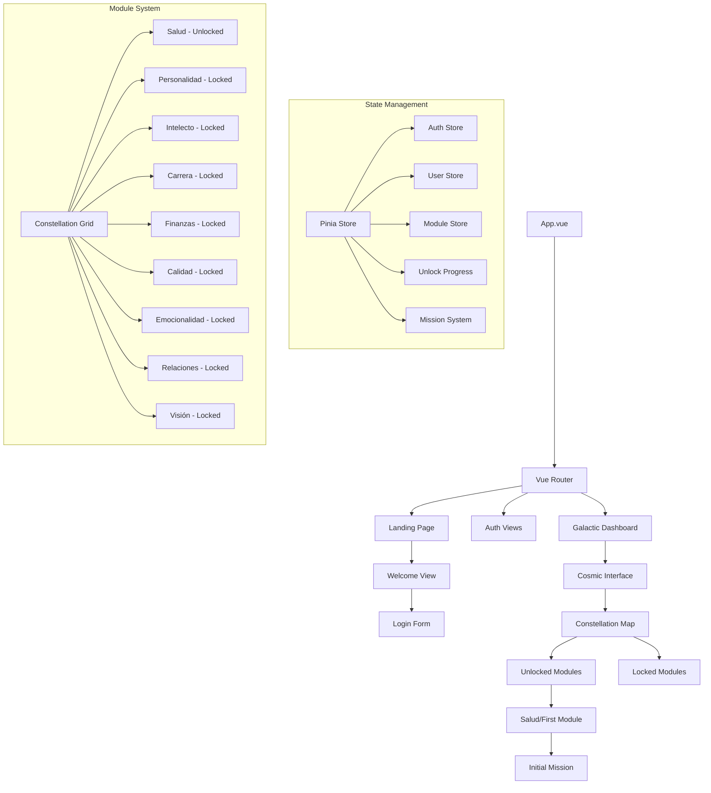
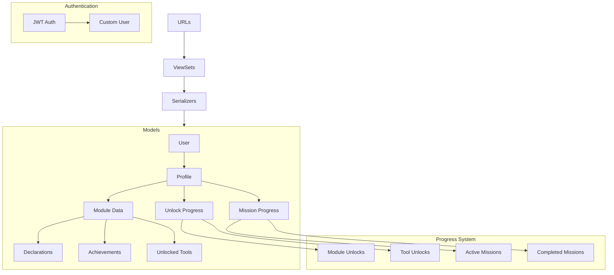
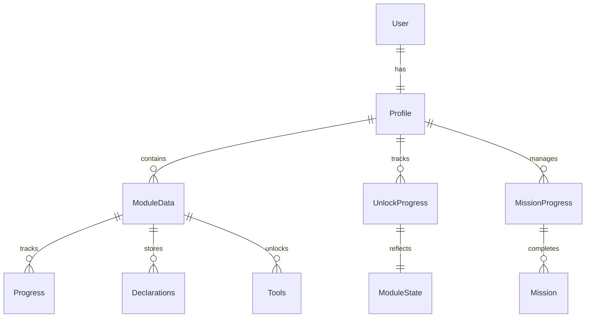
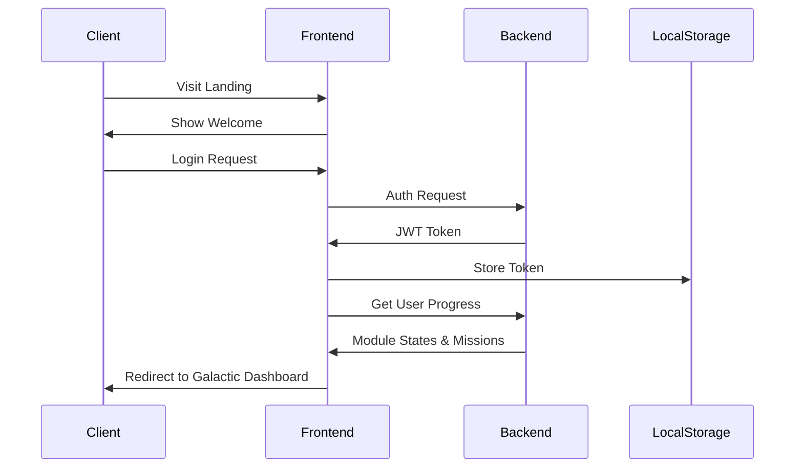
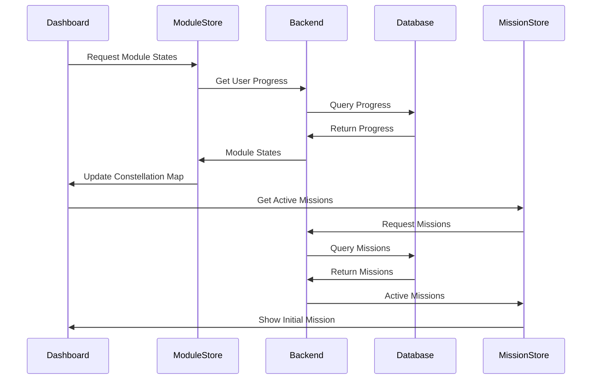

# Dividis System Patterns

## System Architecture

### Overall Architecture


## Key Components

### 1. Frontend Architecture


### 2. Backend Architecture


## Design Patterns

---

### Desacoplamiento de lógica de desbloqueo: módulos vs constelaciones

**Motivación:**  
Permitir que el acceso visual a las constelaciones (navegación, UI) sea independiente de los requisitos funcionales para desbloquear módulos (XP, misiones, etc.), facilitando la evolución de reglas y la experiencia de usuario.

**Implementación:**  
- El backend controla el estado de los módulos (locked/unlocked/completed) según XP, misiones y otros criterios.
- El frontend puede mostrar constelaciones como accesibles aunque el módulo esté bloqueado, permitiendo onboarding, previews o rutas educativas.
- Ejemplo: Salud siempre visible como constelación, pero su módulo requiere XP/misiones para desbloquearse.

**Beneficio:**  
- Permite reglas de progresión complejas sin sacrificar la navegación ni la motivación visual.
- Facilita la introducción de requisitos adicionales (misiones, logros, etc.) para módulos sin romper la experiencia de exploración.

**Ejemplo de código (pseudo):**
```js
// Frontend: constelación siempre visible
const isConstellationActive = (id) => id === 'salud' ? true : backendState[id].visible;

// Backend: módulo requiere XP y misiones
if (user.xp >= module.xp_required && user.has_completed_missions(module)) {
    module.state = 'unlocked';
}
```

---

### 1. Frontend Patterns
- **Composables**: Reusable logic across components
- **Store Pattern**: Centralized state management with Pinia
- **Component Separation**: Script, template, and styles in separate files (SOLID)
- **Route Guards**: Protected routes requiring authentication
- **Component Composition**: Modular, reusable components
- **API Service Layer**: Centralized API communication
- **Unlocking System**: Progressive module access based on achievements
- **Mission System**: Guided user progression through tasks
- **Profile Editing Pattern**: Edición de perfil desacoplada, usando un endpoint dedicado en backend y lógica de actualización reactiva en el store Pinia. El frontend detecta si la respuesta del backend es anidada (user.email) o plana (email) y actualiza el formulario en consecuencia.
- **User Data Normalization**: Manejo de respuestas anidadas del backend (user: {email, ...}) y actualización reactiva del estado global del usuario.
- **Habit Snake Integration**: Lógica de hábitos desacoplada en stores (habitStore.ts, wallStore.ts) y componentes visuales (HabitSnake, GrowthRoom, RankStars, etc.), comunicados vía eventos y Pinia. El store centraliza el estado y lógica de hábitos, mientras los componentes visualizan el progreso, streak y logros. Animaciones GSAP para feedback inmediato y motivación.
- **Declarations Management**: Declaraciones gestionadas con DeclarationInput y DeclarationList, sincronizadas con backend.
- **Constellations Navigation**: ConstellationsMap, ConstellationNavBar, UnlockedTools, PillarTabs y ConstellationView para navegación y experiencia de usuario.
- **Protected Constellation Routes**: Nuevas rutas protegidas para vistas de constelaciones.
- **Cosmic Theme**: Space-themed UI components and animations
- **Responsive Design**: Mobile-first approach with Tailwind CSS

### 2. Backend Patterns
- **ViewSet Pattern**: CRUD operations via DRF ViewSets
- **Service Layer**: Business logic separation
- **Repository Pattern**: Data access abstraction
- **JWT Authentication**: Token-based auth flow
- **Serializer Pattern**: Data transformation and validation
- **Progress Tracking**: User advancement monitoring
- **Mission Management**: Task assignment and completion tracking
- **Module Unlocking**: Achievement-based feature access
- **State Machine**: Module and tool unlock progression

### 3. Data Models


## Critical Implementation Paths

### 1. Authentication Flow


### 2. Module Loading


## Technical Decisions

### 1. Frontend
- Vue 3 Composition API with TypeScript
- Pinia for state management
- Vue Router with navigation guards
- Axios for API requests
- Tailwind CSS for cosmic theme and styling
- Vite for development and building
- Custom animations for cosmic effects
- Mobile-first responsive design

### 2. Backend
- Django REST Framework for API
- SimpleJWT for authentication
- PostgreSQL for database
- Docker for containerization
- Fly.io for deployment

### 3. Development Workflow
- Docker Compose for local development
- Environment-specific configuration
- Automated deployment via Fly.io
- Consistent code formatting
- API documentation with DRF Spectacular

## Security Patterns

### 1. Authentication
- JWT-based authentication
- Token refresh mechanism
- Secure cookie storage
- CSRF protection
- Rate limiting

### 2. Data Security
- HTTPS only
- Environment variables
- Password hashing
- Input validation
- SQL injection prevention

### 3. CORS Configuration
- Whitelist approach
- Specific origins only
- Controlled methods
- Credential handling

## Scalability Considerations

### 1. Infrastructure
- Containerized deployment
- Independent scaling
- Load balancing ready
- Cache-friendly architecture

### 2. Code Organization
- Modular structure
- Lazy loading
- Code splitting
- Efficient bundling

### 3. Performance
- Database optimization
- API response caching
- Asset optimization
- Lazy module loading
